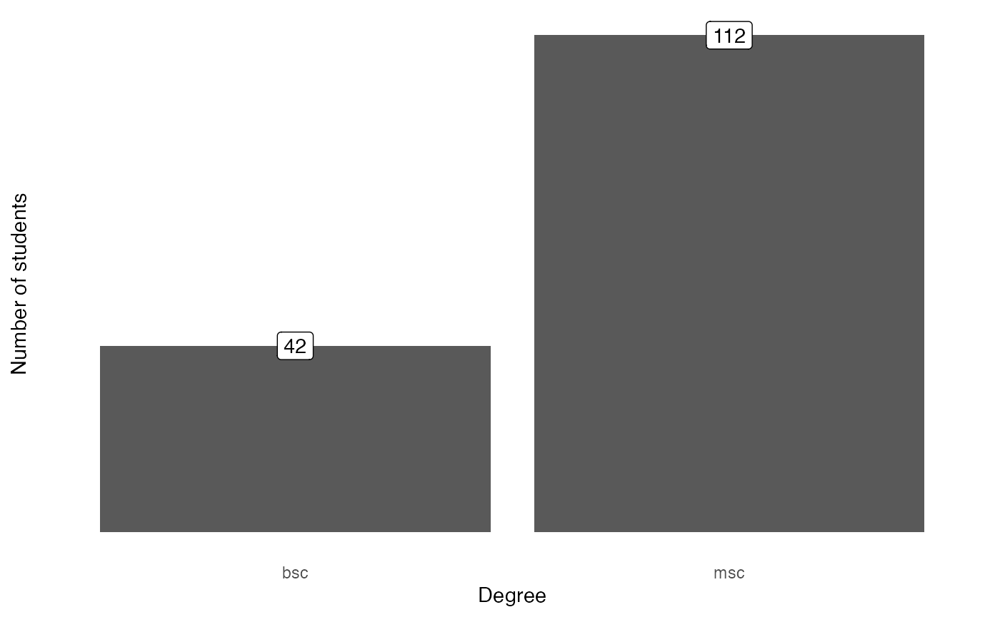
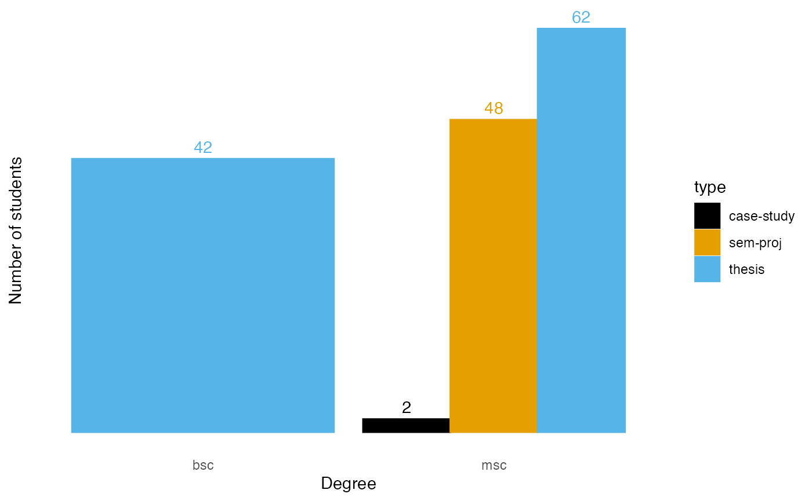
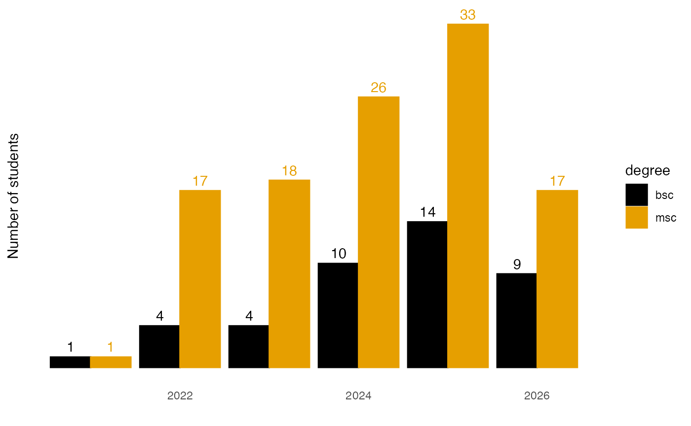
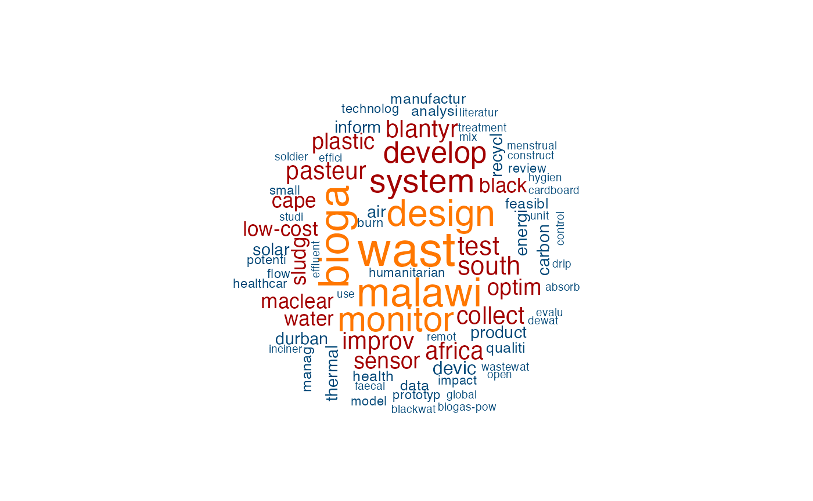

# Example analysis

``` r

library(ghedata)
library(tidyverse)
library(ggthemes)
```

This document provides an overview of the projects that GHE has
supervised so far.

## Students

``` r

undergrad_students <- people |> 
  filter(b_m_student == "yes") |>
  filter(!is.na(title)) 
```

So far, GHE has supervised 154 projects of which 42 were done by BSc and
112 by MSc students.

``` r

undergrad_students |> 
  count(degree) |> 
  ggplot(aes(x = degree, y = n, label = n)) +
  geom_col() +
  geom_label() +
  labs(x = "Degree",
       y = "Number of students") +
  theme_minimal() +
  theme(panel.grid = element_blank(),
        axis.text.y = element_blank())
```



The next chart shows the type of projects supervised. For Bachelor’s
students it was exclusively theses, for Master’s students both semester
projects and theses, with the latter being represented more frequently.

``` r

undergrad_students |> 
  count(degree, type) |> 
  ggplot(aes(x = degree, y = n, label = n, fill = type, color = type)) +
  geom_col(position = "dodge") +
  geom_text(position=position_dodge(width=0.9), 
            vjust=-0.5,
            show.legend = FALSE) +
  labs(x = "Degree",
       y = "Number of students") +
  scale_fill_colorblind() +
  scale_color_colorblind() +
  theme_minimal() +
  theme(panel.grid = element_blank(),
        axis.text.y = element_blank())
#> Warning: `scale_fill_colorblind()` was deprecated in ggthemes 5.2.0.
#> This warning is displayed once per session.
#> Call `lifecycle::last_lifecycle_warnings()` to see where this warning was
#> generated.
```



The number of students has risen steadily over the years, with the
number of Bachelor’s students more than doubling from 2023 to 2024. The
number of Master’s students has risen more slowly in comparison, but is
still significantly higher in absolute numbers.

``` r

undergrad_students |> 
  count(degree, year) |> 
  ggplot(aes(x = year, y = n, label = n, fill = degree, color = degree)) +
  geom_col(position = "dodge") +
  geom_text(position=position_dodge(width=0.9), 
            vjust=-0.5,
            show.legend = FALSE) +
  labs(x = "",
       y = "Number of students") +
  scale_fill_colorblind() +
  scale_color_colorblind() +
  theme_minimal() +
  theme(panel.grid = element_blank(),
        axis.text.y = element_blank())
```



Finally, the word cloud shows the most frequently used terms in the
thesis titles. The larger the font, the more frequently the term was
used. It should be noted that the terms have been reduced to their stems
(e.g. ‘design’, ‘designing’, ‘designed’ all become ‘design’).

``` r

library(quanteda)
#> Package version: 4.4
#> Unicode version: 14.0
#> ICU version: 71.1
#> Parallel computing: disabled
#> See https://quanteda.io for tutorials and examples.
library(quanteda.textplots)

textcorpus <- corpus(undergrad_students$thesis_title)
#> Warning: NA is replaced by empty string

wordcloud <- textcorpus |> 
  tokens(remove_punct = TRUE) |>
  tokens_remove(pattern = stopwords('english')) |>
  dfm() |>
  dfm_trim(min_termfreq = 2, verbose = FALSE) |> 
  dfm_wordstem()

set.seed(100)
textplot_wordcloud(wordcloud,
                   color = c('#004777', '#A30000', '#FF7700'))
```


